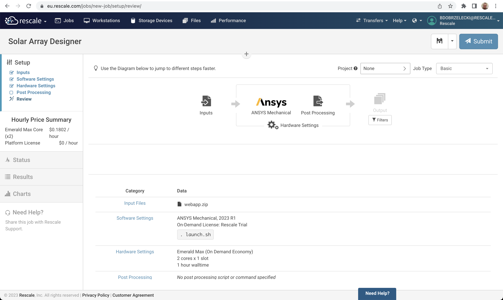
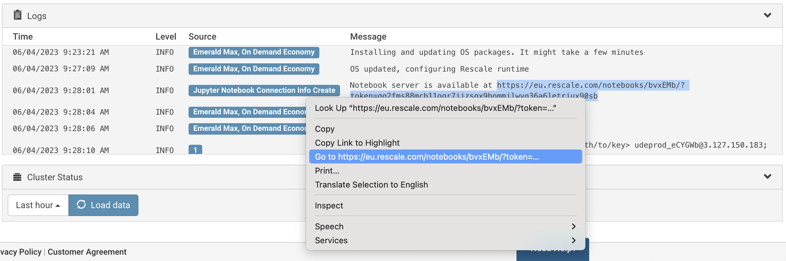

# README

Cantilever Plate App is a [Flask](https://www.google.com/url?sa=t&rct=j&q=&esrc=s&source=web&cd=&cad=rja&uact=8&ved=2ahUKEwihpc6o_6v_AhXOzYsKHcAoAiEQFnoECAwQAQ&url=https%3A%2F%2Fflask.palletsprojects.com%2F&usg=AOvVaw10INQEbdYkEQIifZAl5hxD) web app created for the ANSYS course entitled [ANSYS in a Python Web App application article](https://towardsdatascience.com/ansys-in-a-python-web-app-part-2-pre-processing-solving-with-pymapdl-50428c18f8e7).

We have cloned the [original repository](https://github.com/mikerife/PyMAPDL-WebApp) and made a few changes to make it a Rescale App. The goal is to demonstrate how to port an existing Flask web app to Rescale.

For introduction to Rescale Apps, see [Hello World Rescale App](https://github.com/rescale-labs/App_HelloWorld_Flask).

> NOTE: This App currently requires an active X-Server which is not started on Rescale Batch. A headless version of VTK is needed. Fix is coming. If eager, you can start this Rescale App within the ANSYS Interactive Workflow tile.

## Quick start

Currently, Rescale Apps rely on the `jupyter4all` flag which needs to be enabled for the user, workspace or company. See Hello World repository for details.

### Deploying a Rescale App as Job inputs

Packaging a Dash web app for deployment is straightforward. While inside the root directory of the cloned code repository, issue a zip command to create a web app archive. Create a new Job, upload the archive as inputs, select *ANSYS Mechanical* software tile, set `. launch.sh` as a command, select hardware with 2+ cores and submit.

```
❯ git clone https://github.com/rescale-labs/App_CantileverPlate_PyMAPDL_Flask
❯ cd App_CantileverPlate_PyMAPDL_Flask
❯ zip -r webapp.zip *
```

The review page of your Job should look like this.



Once started, look at the Job Logs section and search for the line mentioning the Notebook server. Highlight the link and open it in a new tab.



### Publishing a Rescale App using Rescale Software Publisher

> TODO: Stay tuned...

## Flask web app porting notes

> TODO: Stay tuned...